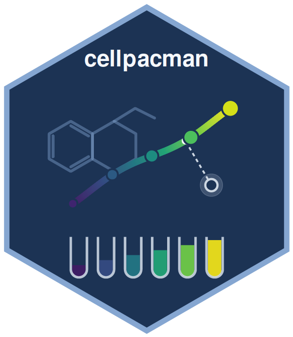
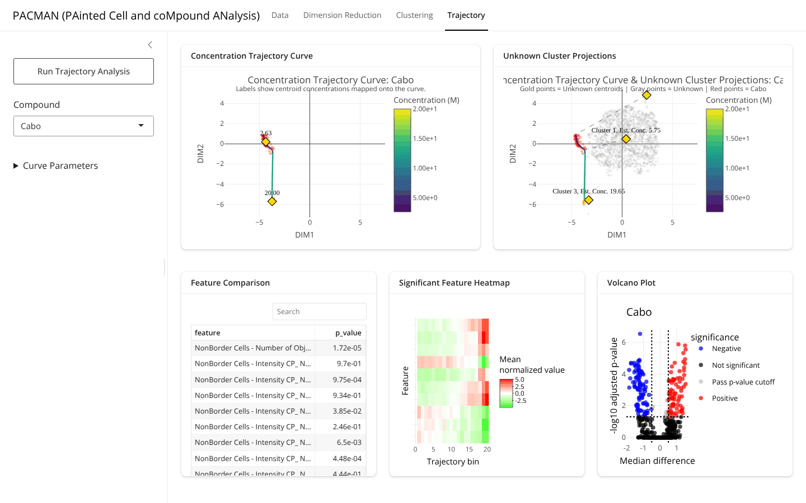

# cellpacman

> **PAinted Cell and coMpound ANalysis (PACMAN) — concentration trajectories for Cell Painting screens**


`cellpacman` answers two questions about a Cell Painting screen that mixes
**known** compounds, tested over a concentration series, with **unknown**
compounds tested at a single concentration — *which known compound does an
unknown resemble, and at what effective concentration?* It summarizes the
graded morphological response of every known compound as a **concentration
trajectory** — a principal curve through the concentration-ordered DBSCAN
centroids of that compound in a UMAP embedding of within-plate standardized
features — and interprets unknown compounds by projecting their clusters onto
these trajectories.

Unlike a nearest-neighbour or classifier lookup against a reference library,
the trajectory is a *continuous* object with an arc-length ↔ concentration
calibration, so an unknown is placed *between* tested concentrations rather
than assigned to one of them, and the distance from the curve reports how well
the match fits. Rank-based feature selection then explains *which*
morphological features drive a trajectory or separate two groups of wells.

▶ **Interactive app (R Shiny):** [`cellpacman-shiny/`](cellpacman-shiny) — the full workflow in a browser, with background computation

▶ **Documentation:** [`vignettes/getting-started.Rmd`](vignettes/getting-started.Rmd) · [`vignettes/shiny-app.Rmd`](vignettes/shiny-app.Rmd) · [`cellpacman_0.1.0_manual.pdf`](cellpacman_0.1.0_manual.pdf)

---

## Highlights

- **Two-table input, one validated object** — a numeric well × feature table
  and a plate annotation sharing `WellId`; `Compound = NA` marks unknown wells
  (`loadCellPainting()`).
- **Within-plate standardization** — every feature is z-scored per plate
  (`normalize()`, any `by` grouping), removing plate effects before geometry
  is computed.
- **Per-compound density clustering** — DBSCAN run separately for each known
  compound and jointly for unknown wells; noise is labelled rather than forced
  into clusters (`compoundCluster()`).
- **Concentration trajectories** — a principal curve (Hastie & Stuetzle, 1989)
  initialized at the concentration-ordered centroid polyline, with each
  centroid's arc length recorded as a calibration reference
  (`curveEstimate()`).
- **Projection with interpolation** — unknown-cluster centroids are projected
  onto every trajectory; the arc length is mapped to a concentration by
  piecewise-linear interpolation between references, and the nearest
  trajectory is the best match (`curveProject()`).
- **Rank-based feature selection** — Wilcoxon rank-sum tests with
  median-difference effect sizes along a trajectory (`selectFeatureCurve()`),
  between unknown clusters (`selectFeatureCluster()`), and between any two
  compounds or clusters (`compareCompoundFeatures()`,
  `compareClusterFeatures()`).
- **Interactive front end** — a Shiny application that calls the same API,
  runs every stage in background R processes, and gates each tab on the stage
  before it.
- **Bundled example screen** — five 384-well plates, 664 features, three
  compounds in eight-point series, 1,600 unknown wells (`exampleDataPath()`).

---

## Installation

```r
# install.packages("remotes")
remotes::install_github("c16267/cellpacman")
```

Or from the source tarball in this repository (dependencies must already be
installed, or use `remotes::install_local()` which resolves them):

```r
install.packages("cellpacman_0.1.0.tar.gz", repos = NULL, type = "source")
```

**Requirements.** R ≥ 4.1.0. Imports `dbscan`, `dplyr`, `ggplot2`, `plotly`,
`princurve`, `readr`, `readxl`, `tibble`, `tidyr`, `umap`, `viridisLite`;
`ggrepel` is optional (plot labels). The Shiny application has its own
dependencies, listed [below](#shiny-application).

---

## Input format

Two tables that share a `WellId` key, supplied as data frames or as
`csv` / `tsv` / `txt` / `xlsx` files:

| Table | Columns | Description |
|-------|---------|-------------|
| feature | `WellId`, then numeric features | One row per well; all non-key columns must be numeric. |
| metadata | `WellId`, `Plate`, `Compound`, `Concentration`, … | `Compound` is the compound name for known wells and `NA` for unknown wells; `Concentration` is numeric. Other columns are carried along. |

Instrument exports (e.g. Harmony) are one wide table; split on the feature
column names and keep the rest as metadata:

```r
raw <- readCellPainting("PlateResults.tsv")
feature_tbl  <- dplyr::select(raw, WellId, dplyr::contains("NonBorder Cells"))
metadata_tbl <- dplyr::select(raw, !dplyr::contains("NonBorder Cells"))
```

---

## Quick start

```r
library(cellpacman)

## 0 — Example screen bundled with the package -------------------------------
dat <- loadCellPainting(
  file.feature  = exampleDataPath("features"),
  file.metadata = exampleDataPath("metadata")
)

## 1 — Standardize within plate and embed -------------------------------------
dat_norm <- normalize(dat, method = "z.score", by = "Plate")
dat_dr   <- dimReduce(dat_norm, method = "umap", random_seed = 1)
plotDimred(dat_dr)                                  # unknown wells in gray

## 2 — Cluster each known compound and the unknown wells ----------------------
clusters <- compoundCluster(dat_dr, method = "dbscan", eps = 0.5, minPts = 5)
plotUnknownClusters(clusters)
plotKnownClusters(clusters, compound = "Cabo")

## 3 — Concentration trajectories for the known compounds ---------------------
curves <- curveEstimate(dat_dr, method = "princurve", eps = 0.5, minPts = 5,
                        smoother = "lowess")
plotKnownCurves(curves, compound = "Cabo")

## 4 — Project unknown clusters onto every trajectory -------------------------
proj <- curveProject(curves)
proj$best_matches        # unknown_cluster, compound, estimated_concentration, distance
plotUnknownProjections(curves, proj, compound = "Cabo")

## 5 — Which features drive a trajectory / separate groups? -------------------
feat_curve   <- selectFeatureCurve(curves, data.norm = dat_norm)       # low vs high arc length
feat_cluster <- selectFeatureCluster(clusters, data.norm = dat_norm)   # unknown cluster pairs
compareCompoundFeatures(dat_norm, first = "DMSO", second = "Cabo")     # any two compounds
compareCompoundFeatures(dat_norm, first = "Cabo", second = NA)         # NA = pooled unknown wells
```

> **Tip.** `curveProject()` also accepts a second `cellpainting_dimred` object
> (`newData`) so that unknowns from a later screen can be projected onto
> trajectories fitted on a reference screen; only the two-dimensional
> coordinates must be comparable, i.e. both must come from the same embedding.

---

## How it works

**Fit a trajectory per known compound, then place every unknown on it.**

| Step | Captures | Model | Function |
|------|----------|-------|----------|
| Standardization | Plate-level technical variation | Per-plate z-score, zero-variance features set to 0 | `normalize()` |
| Embedding | Phenotypic similarity of wells | UMAP, 2 components (`min_dist = 0.25`, seeded) | `dimReduce()` |
| Clustering | Replicate structure; candidate unknown phenotypes | DBSCAN (`eps`, `minPts`) per known compound and jointly on unknowns; cluster 0 = noise | `compoundCluster()` |
| Trajectory | Graded response across concentrations | Principal curve through a compound's non-noise wells, started at the concentration-ordered centroid polyline; arc length λ ↔ mean centroid concentration | `curveEstimate()` |
| Projection | Identity and effective concentration of unknowns | Orthogonal projection of each unknown centroid onto each curve; `approx()` of concentration at the projected λ; best match = smallest distance | `curveProject()` |
| Features | What changes, and where | Two-sided Wilcoxon rank-sum per feature, median difference as effect size, Bonferroni/BH | `selectFeature*()`, `compare*Features()` |

```
loadCellPainting() ─► normalize() ─► dimReduce() ─► compoundCluster() ─► curveEstimate() ─► curveProject()
  two tables           z per plate     UMAP (x, y)    DBSCAN per compound    principal curve     unknown → compound,
                                                      + unknown wells        + λ calibration     concentration, distance
                                                            │                      │
                                                   selectFeatureCluster()   selectFeatureCurve()
```

Every function returns an S3 object (`cellpainting_data` → `cellpainting_normalized`
→ `cellpainting_dimred` → `cellpainting_clusters` / `cellpainting_curves`) that
can be inspected, plotted, or reused, and a `plot*()` function exists for each
stage (static `ggplot2` and interactive `plotly` variants for the trajectory
plots). The full worked example, including the model behind each step, is in
`vignette("getting-started", package = "cellpacman")`.

---

## Shiny application



The [`cellpacman-shiny/`](cellpacman-shiny) directory is a self-contained Shiny
app that drives the package through its exported API — Data → Dimension
Reduction → Clustering → Trajectory — with uploads, analysis stages and
feature comparisons running in background R processes so the interface stays
responsive. It is excluded from the package build and has its own
[README](cellpacman-shiny/README.md), tests and Dockerfile.

```r
# application packages (once)
install.packages(c("shiny", "bslib", "htmltools", "reactable", "shinycssloaders",
                   "plotly", "ggplot2", "dplyr", "tidyr", "future", "promises", "digest"))

# from the repository root, with cellpacman installed
Sys.setenv(CELLPACMAN_EXAMPLE_DATA = "true")   # optional: pre-load the example screen
shiny::runApp("cellpacman-shiny")
```

Requires `shiny ≥ 1.8.1`, `bslib ≥ 0.10.0`, `shinycssloaders ≥ 1.1.0`.
Deployment to Shiny Server, Posit Connect or Docker is described in the
app's README and in `vignette("shiny-app")`.

---

## Repository layout

```
cellpacman/
├── R/, man/, inst/extdata/, tests/, vignettes/   R package (standalone analysis library)
├── DESCRIPTION, NAMESPACE, LICENSE, NEWS.md
├── cellpacman_0.1.0.tar.gz                       built source package (vignettes included)
├── cellpacman_0.1.0_manual.pdf                   reference manual
├── cellpacman-shiny/                             Shiny application (depends on the package)
│   ├── app.R, R/, www/, tests/, Dockerfile, README.md
└── CITATION.cff, cellpacman_logo_v3.png, README.md
```

The dependency runs in one direction only: the application imports the
package (`library(cellpacman)` in `app.R`); the package knows nothing about the
application. `R CMD build .` and `R CMD check` therefore operate on the
package alone.

---

## Citation

If you use `cellpacman`, please cite the package (an application note is in
preparation):

```
Kinnebrew G, et al. (2026). cellpacman: PAinted Cell and coMpound ANalysis (PACMAN) —
concentration trajectories for Cell Painting screens. R package version 0.1.0.
https://github.com/c16267/cellpacman
```

```bibtex
@Manual{cellpacman,
  title  = {cellpacman: PAinted Cell and coMpound ANalysis (PACMAN) -- concentration trajectories for Cell Painting screens},
  author = {Garrett Kinnebrew and others},
  year   = {2026},
  note   = {R package version 0.1.0},
  url    = {https://github.com/c16267/cellpacman}
}
```

---

## References

- Hastie T., Stuetzle W. (1989). Principal curves. *JASA* 84(406):502–516.
  [doi:10.1080/01621459.1989.10478797](https://doi.org/10.1080/01621459.1989.10478797)
- Ester M., Kriegel H.-P., Sander J., Xu X. (1996). A density-based algorithm for
  discovering clusters in large spatial databases with noise. *KDD-96*, 226–231.
- McInnes L., Healy J., Melville J. (2018). UMAP: Uniform Manifold Approximation and
  Projection for dimension reduction. [arXiv:1802.03426](https://arxiv.org/abs/1802.03426)
- Bray M.-A. *et al.* (2016). Cell Painting, a high-content image-based assay for
  morphological profiling using multiplexed fluorescent dyes. *Nature Protocols*
  11:1757–1774. [doi:10.1038/nprot.2016.105](https://doi.org/10.1038/nprot.2016.105)
- Benjamini Y., Hochberg Y. (1995). Controlling the false discovery rate. *JRSS-B*
  57(1):289–300.

---

## Authors & license

Garrett Kinnebrew (aut, cre · `garrett.kinnebrew@osumc.edu`) — released under the
**MIT** license (see `LICENSE`).
