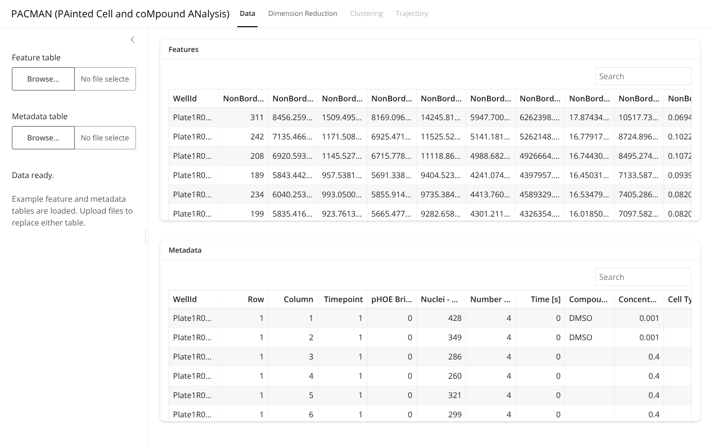
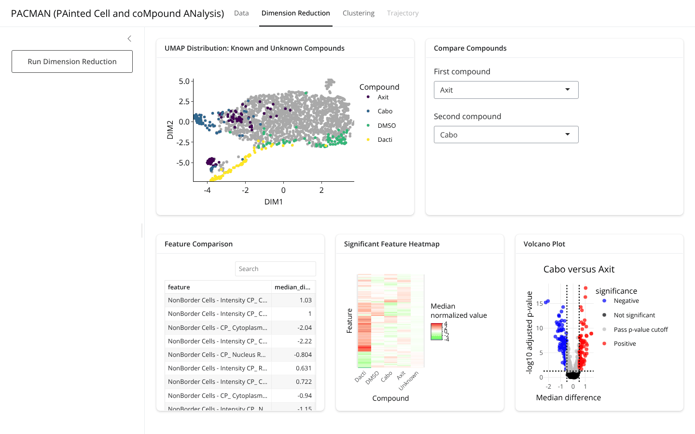
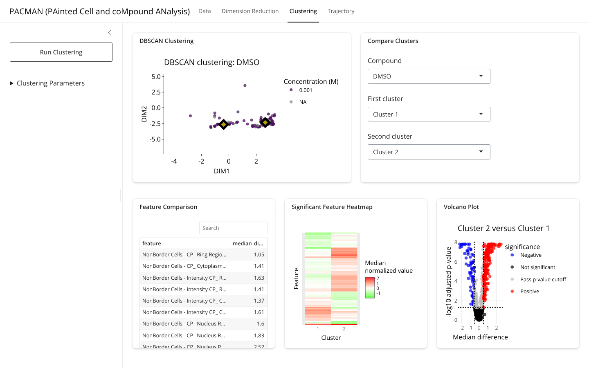

```{r setup, include = FALSE}
knitr::opts_chunk$set(collapse = TRUE, comment = "#>", eval = FALSE)
```

```{css, echo = FALSE}
.main-container { max-width: 1300px !important; }
img { max-width: 100% !important; border: 1px solid #dee2e6; }
```

## What the application is

`cellpacman-shiny` is a Shiny front end to the `cellpacman` package. It is
distributed in the `cellpacman-shiny/` directory of the package repository
(<https://github.com/c16267/cellpacman>) and is excluded from the package
build, so that the package itself stays a dependency-light analysis library
while the application carries the user-interface dependencies (`shiny`,
`bslib`, `reactable`, `plotly`, `future`, ...). The
application performs no analysis of its own: every stage calls the exported
function documented in `vignette("getting-started")`.

| Tab | Interface element | `cellpacman` function |
| --- | --- | --- |
| Data | Feature / metadata upload, previews | `readCellPainting()`, `loadCellPainting()` |
| Dimension Reduction | UMAP embedding | `normalize()`, `dimReduce()`, `plotDimred()` |
| Dimension Reduction | Compare compounds (table, heatmap, volcano) | `compareCompoundFeatures()`, `summarizeCompoundFeatures()` |
| Clustering | DBSCAN plot | `compoundCluster()`, `plotKnownClusters()` |
| Clustering | Compare clusters (table, heatmap, volcano) | `compareClusterFeatures()`, `summarizeClusterFeatures()` |
| Trajectory | Concentration trajectory curve | `curveEstimate()`, `plotKnownCurvesPlotly()` |
| Trajectory | Unknown cluster projections | `curveProject()`, `plotUnknownProjectionsPlotly()` |
| Trajectory | Feature comparison, heatmap, volcano | `selectFeatureCurve()` |

## Running the application

The application directory contains `app.R`, the modules in `R/`, static
assets in `www/`, and its own tests. With `cellpacman` and the application
packages installed (see the application's `README.md`), start it from the
repository root:

```{r run}
remotes::install_github("c16267/cellpacman")   # or install the tar.gz from the repository
shiny::runApp("cellpacman-shiny")
```

Two environment variables configure a session:

| Variable | Default | Effect |
| --- | --- | --- |
| `CELLPACMAN_EXAMPLE_DATA` | `false` | `true` pre-loads the example screen shipped with the package (`exampleDataPath()`). |
| `CELLPACMAN_WORKERS` | `1` | Number of background R processes used for parsing and analysis. |

```{r run-example}
Sys.setenv(CELLPACMAN_EXAMPLE_DATA = "true", CELLPACMAN_WORKERS = "2")
shiny::runApp("cellpacman-shiny")
```

The same directory can be served unchanged by Shiny Server, Posit Connect,
or the Docker image described in the application's `README.md`.

## Walking through the workflow

The navigation bar mirrors the analysis chain. Each tab is enabled only after
the stage it depends on has completed, so the interface cannot be driven into
an inconsistent state.

### Data

Upload a feature table and a metadata table (`csv`, `tsv`, `txt`, or `xlsx`).
Both are parsed and validated with the same rules as `loadCellPainting()`;
validation messages appear under the upload controls, and the tables are
previewed on the right.

```{r data-tab, eval = TRUE, echo = FALSE, out.width = "100%"}

```

### Dimension Reduction

*Run Dimension Reduction* standardizes the features within plate and computes
the UMAP embedding. The embedding is shown with unknown wells in gray. The
*Compare Compounds* panel contrasts any two compound groups (the pooled
unknown wells are one of the choices) with per-feature Wilcoxon tests; the
significant features (FDR < 0.05) are summarized as a heatmap of per-group
medians and as a volcano plot.

```{r dimred-tab, eval = TRUE, echo = FALSE, out.width = "100%"}

```

### Clustering

*Run Clustering* applies DBSCAN with the `eps` and `minPts` values set under
*Clustering Parameters*. The plot shows the clusters and centroids of the
selected compound; the *Compare Clusters* panel contrasts two clusters of that
compound.

```{r clustering-tab, eval = TRUE, echo = FALSE, out.width = "100%"}

```

### Trajectory

*Run Trajectory Analysis* fits the principal curves, projects the unknown
clusters onto them, and runs the along-trajectory feature selection. The left
plot shows the selected compound's curve with its concentration calibration;
the right plot adds the unknown centroids, their projections, and the
estimated concentrations. The bottom row lists the features that change along
the trajectory, their binned profile, and a volcano plot.

```{r trajectory-tab, eval = TRUE, echo = FALSE, out.width = "100%"}
knitr::include_graphics("../man/figures/app-trajectory.png")
```

## How computation is organized

Parsing, validation, and the three analysis stages run in background R
processes (`future::multisession`, one worker by default), wrapped in
`shiny::ExtendedTask`. The interface therefore remains responsive while a
stage runs: the buttons switch to a busy state in the browser before any R
code executes, and output spinners stay visible until results arrive.

Each session caches the most recent successful result of every stage.
Re-running a stage with identical data and settings reuses the cached result
instead of starting a new job, while replacing an input table invalidates
every downstream result. If a request is superseded while it is running, the
obsolete result is discarded when it arrives.

Because the workers load the *installed* `cellpacman` namespace, the package
must be reinstalled (and the application restarted) after its code changes.

## Testing the application

The application ships with its own `testthat` suite:

```{r tests}
testthat::test_dir("cellpacman-shiny/tests/testthat")
```

The tests exercise the server with `shiny::testServer()` (uploads, stage
caching and invalidation, error recovery, background tasks). An additional
browser test drives the real interface in headless Chrome through
`shinytest2` and checks that uploads and analyses acknowledge work before it
finishes; it is skipped when `shinytest2` is not installed.
